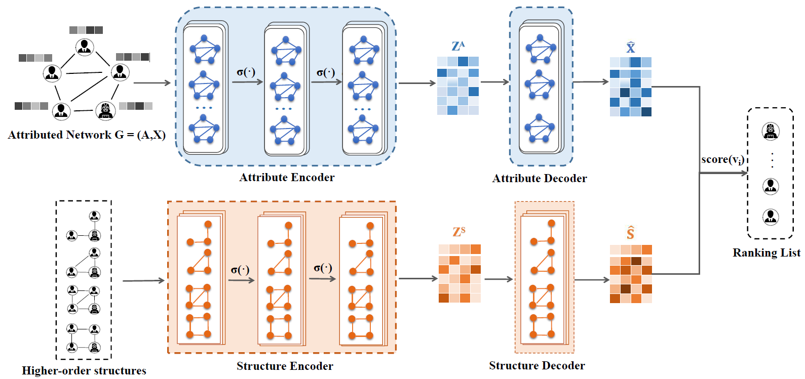

# Higher-order Structure Based Anomaly Detection on Attributed Networks in Pytorch

PyTorch implementation of Higher-order Structure Based Anomaly Detection on Attributed Networks (GUIDE) [1].



## Usage

#### Motif Degree Counting

```shell
python motif4mat.py --dataset cora
```


#### Run GUIDE train

```shell
python guide_train.py --dataset cora
```

## References

[1] [ X. Yuan, N. Zhou, S. Yu, H. Huang, Z. Chen and F. Xia, "Higher-order Structure Based Anomaly Detection on Attributed Networks," *2021 IEEE International Conference on Big Data (Big Data)*, 2021, pp. 2691-2700.](https://ieeexplore.ieee.org/document/9671990/)


## Cite

Please cite our paper if you use this code in your own work:

```latex
@INPROCEEDINGS{guide2021yuan,
  author={Yuan, Xu and Zhou, Na and Yu, Shuo and Huang, Huafei and Chen, Zhikui and Xia, Feng},
  booktitle={2021 IEEE International Conference on Big Data (Big Data)}, 
  title={Higher-order Structure Based Anomaly Detection on Attributed Networks}, 
  year={2021},
  pages={2691-2700},
}
```

